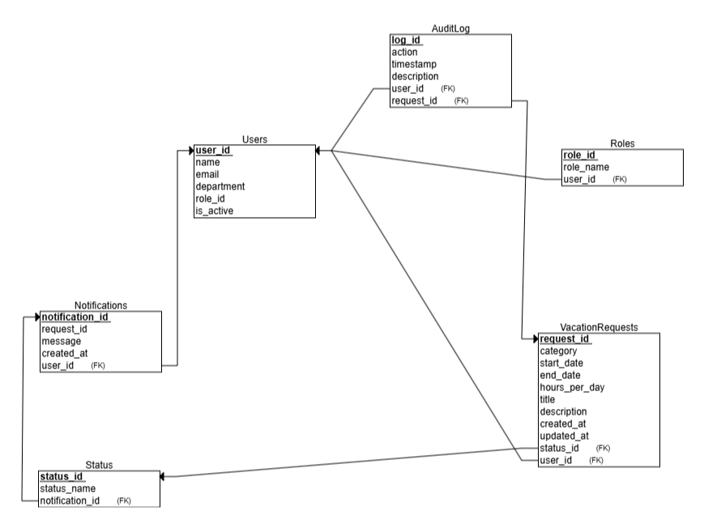
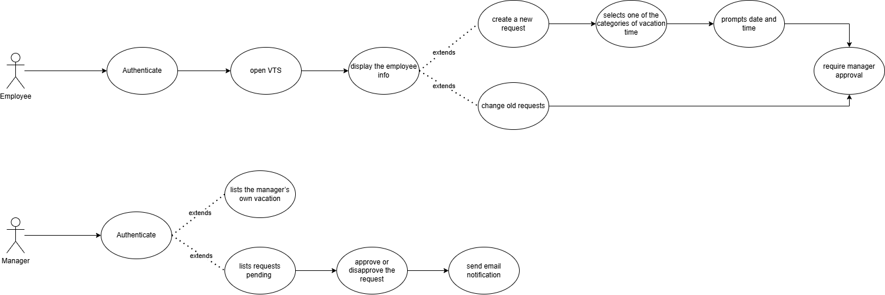
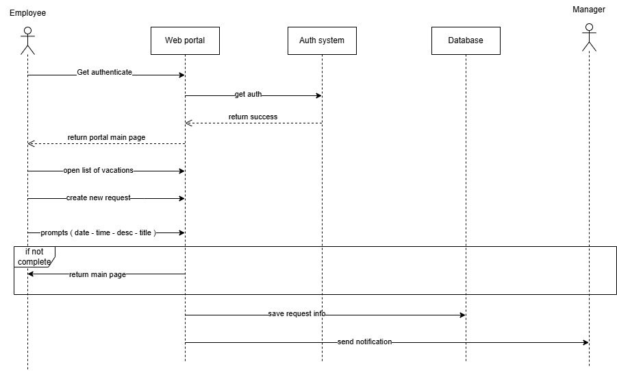
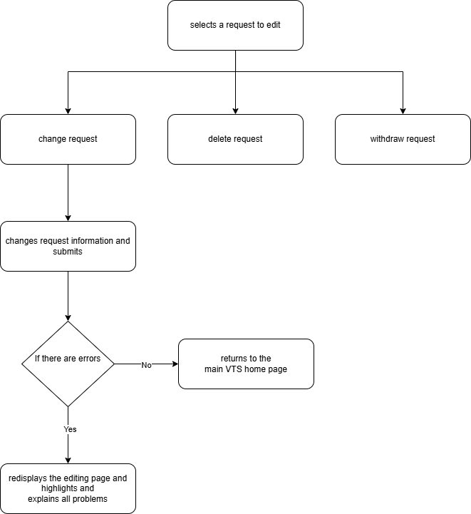
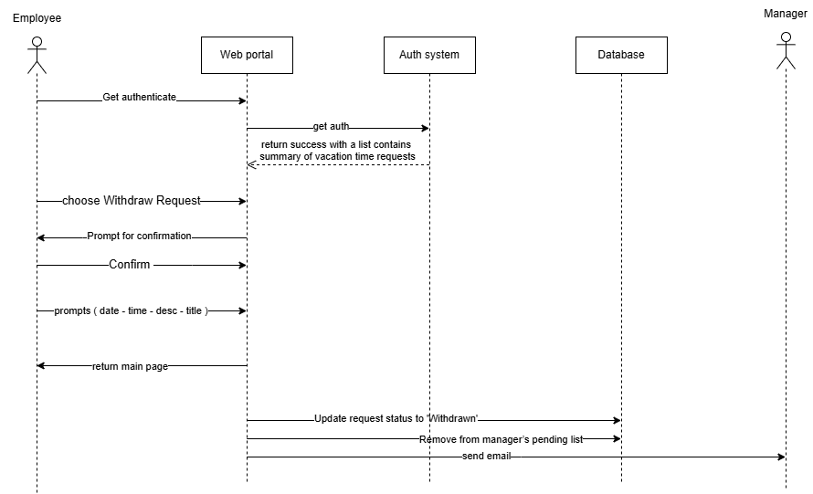
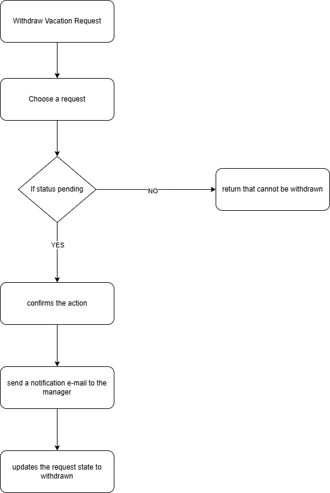
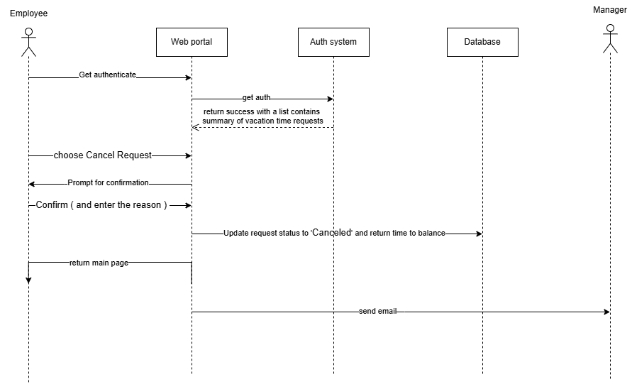
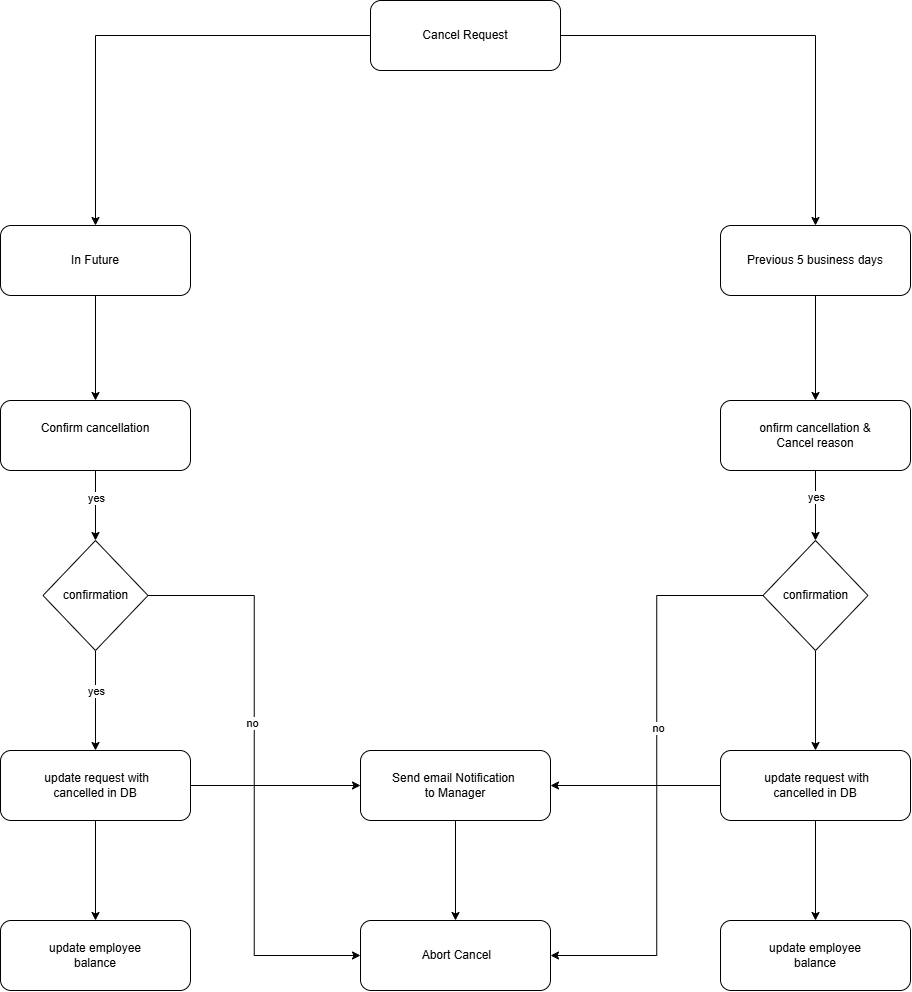
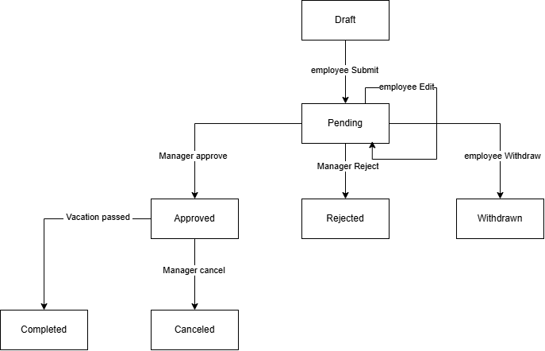

# 🌐 Vacation Tracking System (VTS) - Requirements Documentation

## 📌 Domain
The system operates within the domain of **Human Resources** and **organizational management**. It serves employees, managers, and HR personnel by simplifying the vacation request process. The system eliminates the need for individuals to manually understand and interpret company leave policies, and it provides an efficient mechanism for tracking and managing employee leave records.

---

## 🎯 Vision
The system will **empower employees** to independently manage their vacation time, sick leave, and personal time off without requiring in-depth knowledge of company policies or facility-specific leave procedures.

---

## ⛓️ System Constraints

1. **Policy Compliance**  
   The system must fully comply with the organization’s leave and HR policies. Any override actions taken by HR must be properly logged for accountability and audit purposes.

2. **Technical Infrastructure**  
   The system must operate using existing hardware and middleware infrastructure. It must also support integration with external systems, including potential legacy HR and payroll systems.

3. **Data Privacy and Access Control**  
   All system activity logs must be restricted to managerial access only. Unauthorized personnel must not be able to view or modify log data.

---

## ✅ Functional Requirements

1. **Role-Based Access**  
   The system supports multiple user roles including Employee, Manager, and HR, each with tailored access and permissions.

2. **Vacation Request Submission**  
   Employees can submit vacation, sick leave, or personal leave requests through the system interface.

3. **Full Vacation History View**  
   Employees and managers can view the complete vacation history for individual users.

4. **Real-Time Notifications**
   - Managers receive alerts when a new leave request requires their review.  
   - Employees are notified about the status of their requests (e.g., pending, approved, rejected).

5. **HR Oversight and Override Capability**  
   The HR department has full access to all leave requests and may override or act on any request—even outside of standard policy—if necessary.

6. **Web Service Interface**  
   Provides a web service API for other internal systems to query an employee’s vacation request summary.

7. **Legacy System Integration**  
   Interfaces with existing HR legacy systems to retrieve up-to-date employee data and changes (e.g., promotions, transfers, balances).

---

## 🛠️ Non-Functional Requirements

1. **Ease of Use**  
   The system shall be user-friendly and easily operable by non-technical users without requiring prior training.

2. **Scalability**  
   The system shall be scalable to support a wide range of users, from small teams to large organizations with thousands of employees.

3. **System Integration**  
   The system shall allow seamless integration with external and legacy systems through standard interfaces.

4. **Performance**  
   The system shall efficiently handle various types of employee information retrieval requests with minimal response time.

5. **Availability**  
   The system shall maintain high availability and be accessible during all official working hours at a minimum.

6. **Security**  
   The system shall ensure complete data security, preventing unauthorized access and eliminating the risk of information leakage.

---

## 🧑‍🤝‍🧑 System Actors

1. **Employee**
   - Submits vacation, sick leave, or personal time requests.  
   - Views personal leave balance and request history.

2. **Manager**
   - Reviews and approves or rejects leave requests from team members.  
   - Monitors team leave schedules and balances.  
   - Receives alerts for pending actions.

3. **HR (Human Resources)**
   - **HR Manager**: Has full access to employee leave records, approves special cases, and performs overrides when necessary.  
   - **HR Officer/Staff**: Handles general HR operations, monitors requests, and maintains leave policy enforcement.

4. **System Administrator**
   - Monitors overall system performance and security.  
   - Manages user roles, access permissions, and system configuration.  
   - Has audit-level visibility across the entire system.

---

## ERD diagram

| From Table           | To Table             | Relationship Type | Description                                  |
| -------------------- | -------------------- | ----------------- | -------------------------------------------- |
| **Users**            | **Roles**            | Many-to-One (M:1) | Many users can have the same role.           |
| **VacationRequests** | **Users**            | Many-to-One (M:1) | Each request is submitted by one user.       |
| **VacationRequests** | **Status**           | Many-to-One (M:1) | Each request has one status.                 |
| **Notifications**    | **Users**            | Many-to-One (M:1) | Each notification is sent to one user.       |
| **Notifications**    | **VacationRequests** | Many-to-One (M:1) | Each notification may relate to one request. |
| **AuditLog**         | **Users**            | Many-to-One (M:1) | Each log is performed by one user.           |
| **AuditLog**         | **VacationRequests** | Many-to-One (M:1) | Each log relates to one vacation request.    |

---

## USE CASE diagram

---

## Sequence diagram for manage time

## flowchart for Edit Pending Request manage time

---

## Sequence diagram for Withdraw Vacation Request

## flowchart for Withdraw Vacation Request

---

## Sequence diagram for Cancel Approved Vacation Request

## flowchart for Cancel Approved Vacation Request

---

## State diagram for The Request

